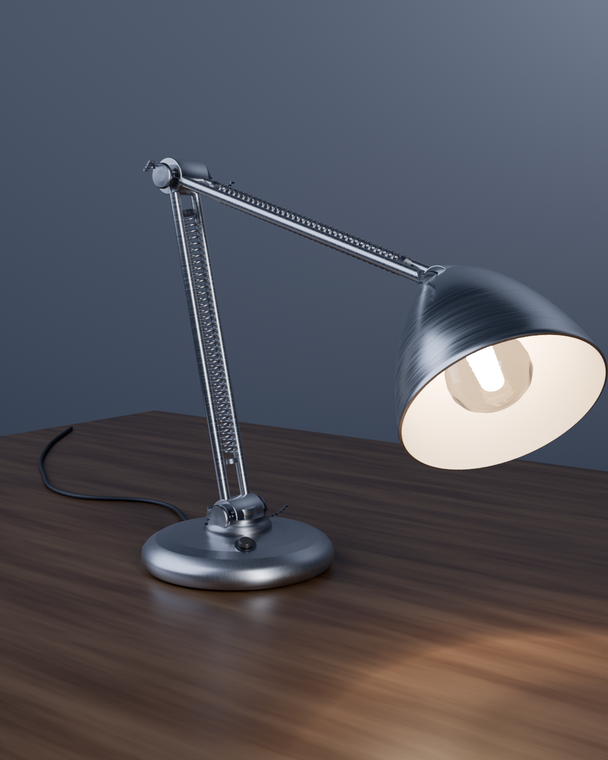
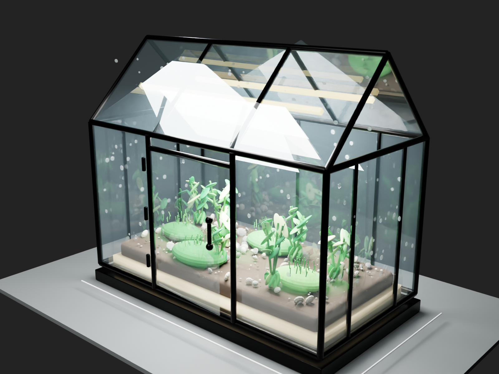
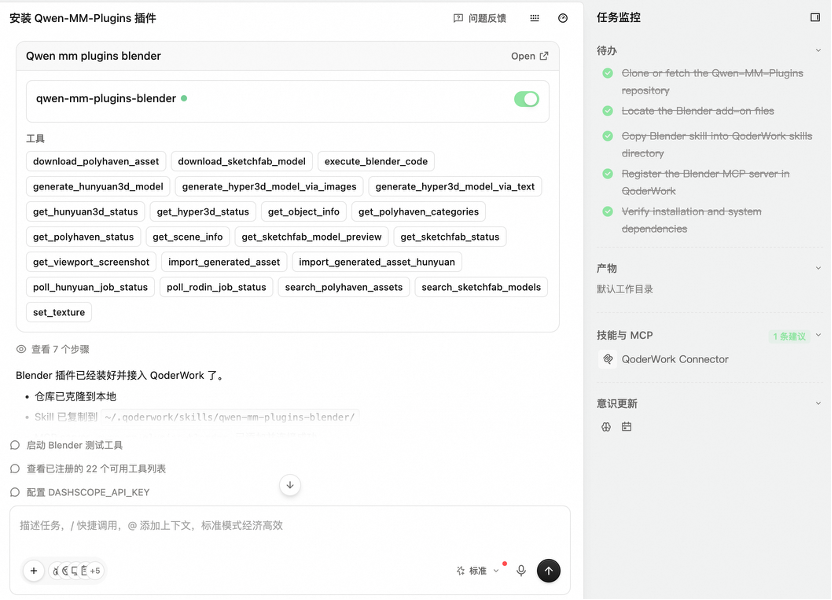

# Cookbook — Qwen-MM-Plugins Blender

Driving a **real, running** Blender from a prompt with `qwen-mm-plugins-blender`: the model models
the scene, lights it, renders with Cycles, writes the project file to disk, and returns screenshots.
See the [Cases](#cases) below. (For parametric CAD, see [cookbooks/freecad](../freecad/usage.md).)

> This capability connects to a **running** Blender carrying the bundled addon. You don't start it by
> hand — after installing, the first query brings it up automatically (on Linux it also auto-downloads
> the app if missing). It needs **no API key** (some asset/generation back-ends have their own keys,
> set inside Blender).

---

## Tools

**Scene & code**
- `execute_blender_code` — run arbitrary Python in Blender (the workhorse)
- `get_scene_info` — summarize the current scene
- `get_object_info` — inspect one object
- `get_viewport_screenshot` — capture the viewport

**PolyHaven assets**
- `get_polyhaven_status`, `get_polyhaven_categories`, `search_polyhaven_assets`, `download_polyhaven_asset`, `set_texture`

**Sketchfab models**
- `get_sketchfab_status`, `search_sketchfab_models`, `get_sketchfab_model_preview`, `download_sketchfab_model`

**Hyper3D / Rodin generation**
- `get_hyper3d_status`, `generate_hyper3d_model_via_text`, `generate_hyper3d_model_via_images`, `poll_rodin_job_status`, `import_generated_asset`

**Hunyuan3D generation**
- `get_hunyuan3d_status`, `generate_hunyuan3d_model`, `poll_hunyuan_job_status`, `import_generated_asset_hunyuan`

For exact schemas, check the installed Skill or the MCP tool list.

---

## Install

```bash
claude plugin marketplace add https://github.com/QwenLM/Qwen-MM-Plugins.git
claude plugin install qwen-mm-plugins-core@qwen-mm-plugins
claude plugin install qwen-mm-plugins-blender@qwen-mm-plugins
```

On a **headless server** (a cloud host / SSH with no display), one extra step (needs root):

```bash
sudo apt install xvfb
```

> Skip this on a desktop with a real display.

For Codex and other harnesses, use the [guided installer](../../docs/en/installation.md#guided-installer).
Harness-specific Skill + MCP registration is covered in [Manual harness setup](../../docs/en/manual_harnesses.md).

## Environment variables (usually none needed)

| Variable | Purpose | Default |
|----------|---------|---------|
| `BLENDER_HOST` / `BLENDER_PORT` | connection target | `localhost` / `9876` |
| `QWEN_MM_AUTOLAUNCH` | set to `1` to launch Blender on the first tool call | off (preset to `1` in the plugin manifests) |
| `QWEN_MM_NO_AUTO_INSTALL` | set to `1` to disable auto-download when the app is missing | off (auto-download by default) |
| `QWEN_MM_CACHE` | where auto-downloaded apps live | OS cache dir |
| `BLENDER_BINARY` | path to the Blender binary (else search PATH, else auto-download) | unset |

> On non-Linux-x86_64 platforms (auto-download only covers Linux-x86_64), install Blender 4.2.x
> yourself and put it on PATH, or point at it with `BLENDER_BINARY`.

> Set these via env vars, `~/.qwen-mm-plugins/config`, or the guided installer **`bash install.sh`** (`bash install.sh verify` checks what's set).

---

## Cases

### Case 1 — model a desk lamp from scratch, then render it with Cycles (Claude Code)

```text
Model a desk lamp from scratch — articulated arm, weighted base, a shade with a visible bulb
inside. Real-world dimensions, brushed metal plus an emissive bulb, lit from inside the scene.
Render it with Cycles when it looks right.
```

44 tool calls: `get_scene_info` on the empty scene, then 28 × `execute_blender_code` in small chunks —
bmesh lathes for the base and shade, a bevelled helix for the tension spring, a 26× radial array for
the knurled knobs. Verification went through renders rather than viewport screenshots: it rendered to
a PNG and read the file back 13 times before it was satisfied.

▶ **[View the detailed trace in Claude Code](case-blender-cc-desk-lamp.html)**

<p align="center">
  
</p>

Two of the fixes are things only a render could reveal: a clear-glass bulb that read as a white blob,
and a back wall too narrow for the frame. That is the **verify** half of the loop doing actual work.

### Case 2 — glass greenhouse terrarium, debugged through viewport screenshots (Codex)

```text
Model a miniature greenhouse terrarium from scratch: a clear glass house with a pitched roof,
black metal frame bars, a hinged front door with tiny handle, layered soil and pebbles inside,
moss mounds, several small leafy plants, condensation droplets on the glass, and warm grow-light
strips under the roof. Use real-world dimensions, transparent glass and varied plant materials,
set up camera and Cycles lighting, verify visually with at least one render or viewport screenshot,
then save the finished scene and final render to cookbooks/blender/assets/ as
blender-codex-terrarium.blend and blender-codex-terrarium.png.

Work only through the qwen-mm-plugins-blender MCP tools. Do not use shell commands.
```

16 Blender MCP calls: `get_scene_info` to read the scene, 10 × `execute_blender_code`, 4 ×
`get_viewport_screenshot` interleaved as visual checks, and a closing `get_scene_info`. The terrarium
is laid out at tabletop scale (1.20 m long, 0.65 m deep, ~1.05 m to the ridge) and the finished scene
carries **873 objects and 37 materials** — glass panes, metal frame bars, a hinged door with handle,
layered substrate, pebbles, moss, individual leaves, condensation droplets, and grow-light strips.

▶ **[View the detailed trace in Codex](case-blender-codex-terrarium.html)**

<p align="center">
  
</p>

### Case 3 — ask a GUI harness to install Blender support

The agent is asked to install the `blender` plugin from this repository:

<p align="center">
  
</p>

---

## Troubleshooting

- **Can't connect / first call is slow**: the first call downloads Blender (~300 MB) in the
  background and starts it — wait 1–2 min; subsequent queries connect instantly. For manual or
  source-checkout launch commands, see the [Skill](../../src/capabilities/blender/skill/SKILL.md).
- **Headless machine reports xvfb errors**: `sudo apt install xvfb` (needs root). Not needed with a
  real display.
- **PolyHaven / Sketchfab / Hyper3D tools report "disabled"**: those asset / generation services
  need their own API key configured app-side (PolyHaven is free); leaving them unset doesn't affect
  anything else.

## Attribution & License

- **blender** is ported from [ahujasid/blender-mcp](https://github.com/ahujasid/blender-mcp) (MIT)
- We also acknowledge the official Blender [projects.blender.org/lab/blender_mcp](https://projects.blender.org/lab/blender_mcp) (GPL-2.0-or-later, referenced only — none of its code is used)

Full third-party licenses are in the capability's `NOTICE.md`.
