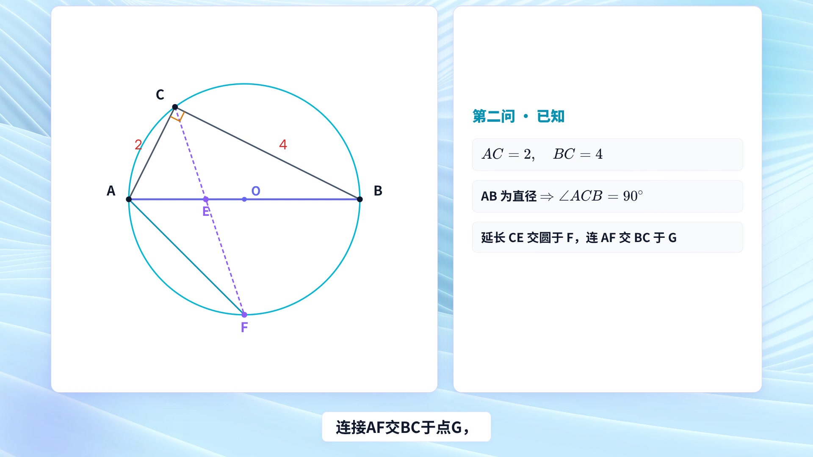
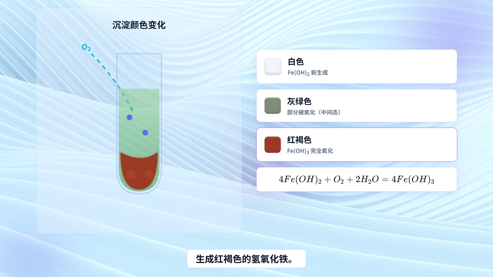
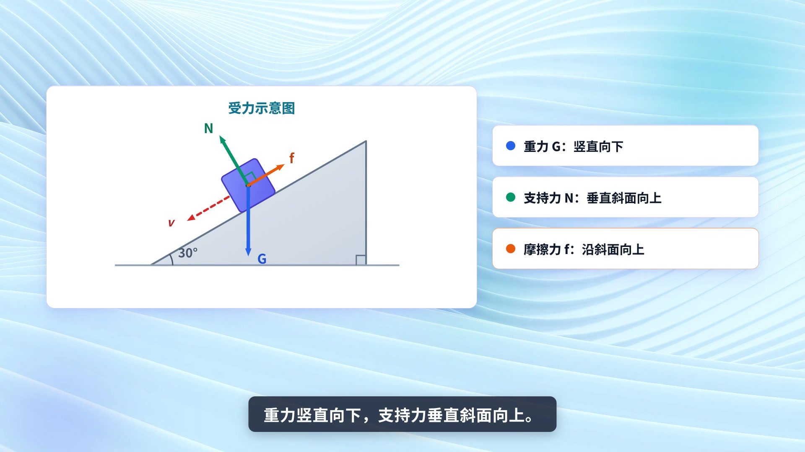

# Cookbook — Qwen-MM-Plugins Edu Agent

`qwen-mm-plugins-edu-agent` turns a K12 problem — typed, pasted as LaTeX, or handed over as a photo —
into a narrated Chinese explainer **video** (1920×1080) or an interactive page. It is **skill-only**:
there is no MCP server, so the model itself solves the problem, scripts the lesson, renders the
scenes, voices the narration, and gates the result before handing it to you.

---

## How it works (no MCP tools)

A pure Agent Skill. Each step writes an artifact the next one reads, so the run is inspectable:

| Step | Does | Artifact |
|------|------|----------|
| 0 | Reads problem images from `image_assets/`, transcribes text + LaTeX | `PROBLEM.md` |
| 1 | Classifies the problem, solves it, outlines numbered steps | `ANALYSIS.md` |
| 2 | Writes the Chinese narration, 3.5-4.0 characters/second | `SCRIPT.md` |
| 3 | Synthesizes speech per sentence, measures each clip's real duration | `narration.wav`, `transcript.json`, `captions.json` |
| 4 | Designs per-scene layout, animation, and transitions | `STORYBOARD.md` |
| 5 | Builds one HTML composition per scene | `compositions/*.html` |
| 6 | Assembles, renders, and verifies the render | `index.html` + MP4 |

Narration is DashScope Qwen-TTS (`qwen3-tts-flash`), synthesized sentence-by-sentence through a
thread pool — so caption timestamps are measured from real audio, not estimated — then loudness
normalized to EBU R128 −16 LUFS. Rendering runs through `npx hyperframes` on headless Chromium.

**Visuals come from a library, not from scratch.** 83 pre-built K12 components ship with the skill
across 9 families — `math`, `mechanics`, `motion`, `optics`, `circuit`, `chemistry`, `fluid`, `wave`,
`indicators` — plus schematic symbols for circuit diagrams. The default theme is "Aurora Scholar"
(light, opaque panels, blue wave texture); 4 alternates are available (清雅湖蓝, 柔紫轻盈, 薄荷清新,
暖黄纸感).

## Two deliverables

- **Narrated MP4** (default) — the Step 0-6 pipeline above.
- **Interactive page** — when you ask for 交互式网页 instead of a video, the skill switches to a
  self-contained offline `index.html`: sliders and controls that update a live graph and equation.

## Render gates

Delivery is blocked until two scripts pass — 35 checks in total. **`precheck.py`** runs before
rendering: CJK font on every Chinese string (else 豆腐块), KaTeX escaping, no CDN URLs in the
air-gapped render sandbox, captions pinned and bounded, scenes fitting 1920×1080, SVG labels clear
of each other and of the figure, geometry coordinates verified against the problem's constraints.
**`postcheck.py`** then runs on the rendered MP4, confirming every line and curve that should be
painted actually is — the "有点、没线" failure that no pre-render check can see.

---

## Install

```bash
claude plugin marketplace add https://github.com/QwenLM/Qwen-MM-Plugins.git
claude plugin install qwen-mm-plugins-core@qwen-mm-plugins
claude plugin install qwen-mm-plugins-edu-agent@qwen-mm-plugins
```

## Prerequisites

Skill-only means `uvx` installs nothing for it — prepare the runtime yourself:

```bash
# Node.js >= 18 + npx — scaffold and render via hyperframes
node -v

# Python deps — TTS synthesis and assembly
python3 -m pip install dashscope soundfile numpy requests

# ffmpeg — loudness normalization and frame extraction for the self-check
apt install ffmpeg                      # macOS: brew install ffmpeg

# minimal Linux only — Chrome OS libs + CJK font (without the font, Chinese renders as tofu)
apt install libnss3 libatk-bridge2.0-0 libgbm1 libasound2 libxkbcommon0 libgtk-3-0 fonts-noto-cjk
```

Headless Chromium is downloaded by puppeteer on first `npx hyperframes`; point
`PUPPETEER_EXECUTABLE_PATH` at a system Chrome to reuse one instead.

📖 Full dependency table and network boundary: the skill's
[SKILL.md § Prerequisites](../../src/capabilities/edu-agent/skill/SKILL.md). General setup:
[installation.md](../../docs/en/installation.md).

## Environment variables

| Variable | Description |
|----------|-------------|
| `DASHSCOPE_API_KEY` | Required — Qwen-TTS narration. |

> Set these via env vars, `~/.qwen-mm-plugins/config`, or the guided installer **`bash install.sh`** (`bash install.sh verify` checks what's set).

---

## Using it

Hand over the problem in whatever form you have it:

```
# typed or pasted
把这道题讲一遍，生成解题视频：一个物体在倾角 30° 的粗糙斜面顶端由静止释放，沿斜面加速下滑，
画出受力示意图并标出各力方向。

# a photo of the problem
@image_assets/ 讲解这道题并生成视频

# interactive page instead of a video
做一个交互式网页，让我拖动参数实时看图象和解析式怎么变
```

Typical length runs 30-60s for a single equation, 60-120s for multi-step algebra, and 90-150s for a
geometry proof.

---

## Cases

Three subjects, one pipeline — each recording is the finished MP4, narrated and subtitled.

### Case 1 — circle proof and radius computation (math, 84s)

> AB 是 ⊙O 的直径，点 C、D 在 ⊙O 上，CE 平分 ∠ACB。(1) 求证 DE ∥ AB；(2) 延长 CE 交 ⊙O 于 F，连 AF
> 交 BC 于 G，过 G 作切线交 AB 延长线于 H。若 AC = 2，BC = 4，求半径 R。

The figure is constructed on screen rather than pasted in — circle, chords, the right angle at C,
then F — with the reasoning tracked in a side panel. Part (1) resolves into three proof steps
(弧AE = 弧BE → E 是弧 AB 中点 → DE ∥ AB); part (2) finds the right angle, applies the Pythagorean
theorem, and lands on R = AB/2 = √5.

▶ **[Watch the recording](https://qianwen-res.oss-accelerate.aliyuncs.com/Qwen-MM-Plugins/asserts/edu-agent/case-edu-agent-math.mp4)**

<p align="center">
  
</p>

### Case 2 — identifying Fe²⁺ by precipitate colour (chemistry, 89s)

> 向盛有浅绿色溶液的试管中滴入 NaOH 溶液，观察到白色沉淀迅速变为灰绿色、最终变为红褐色。推断浅绿色
> 溶液中含有的离子，并解释沉淀颜色变化的原因。

The problem card highlights each observed colour in turn, then the lesson runs the experiment: a
dropper adds NaOH to the test tube, white Fe(OH)₂ forms, and O₂ oxidizes it through grey-green to
red-brown Fe(OH)₃ — with a colour legend mapping each stage to its oxidation state and the two ionic
equations kept on screen.

▶ **[Watch the recording](https://qianwen-res.oss-accelerate.aliyuncs.com/Qwen-MM-Plugins/asserts/edu-agent/case-edu-agent-chemistry.mp4)**

<p align="center">
  
</p>

### Case 3 — force analysis on a rough incline (physics, 58s)

> 一个物体在倾角 30° 的粗糙斜面顶端由静止释放，沿斜面加速下滑。画出物体受力示意图，标出各力方向，
> 注意摩擦力方向。

The incline is drawn with the block and its velocity, then one force is added at a time — G vertically
down, N perpendicular to the surface, f up the slope — each narrated as it appears, so the friction
direction is argued from the motion rather than asserted. It closes on the three-force summary.

▶ **[Watch the recording](https://qianwen-res.oss-accelerate.aliyuncs.com/Qwen-MM-Plugins/asserts/edu-agent/case-edu-agent-physics.mp4)**

<p align="center">
  
</p>
