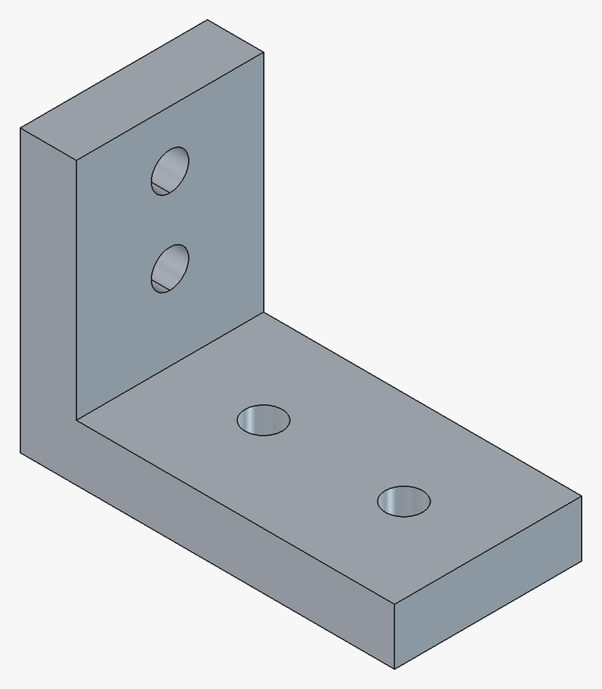
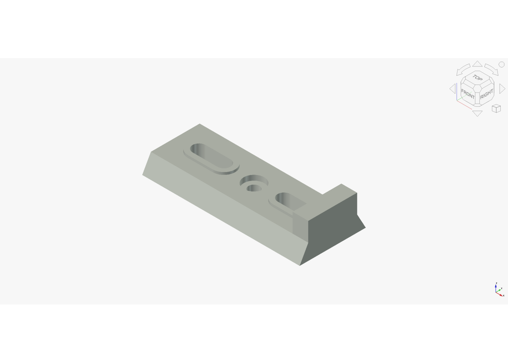
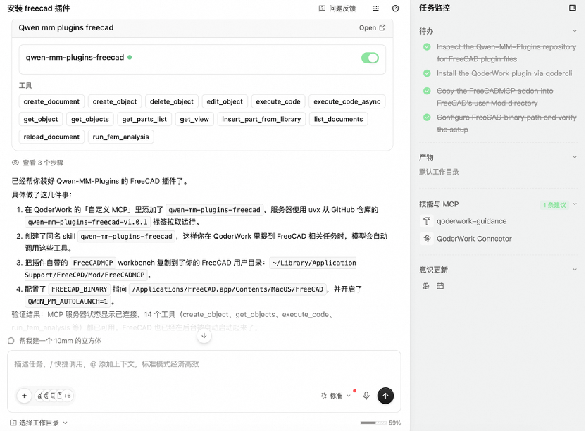

# Cookbook — Qwen-MM-Plugins FreeCAD

Driving a **real, running** FreeCAD from a prompt with `qwen-mm-plugins-freecad`: the model builds a
parametric part, cuts geometry with booleans, and exports STEP/STL. See the [Cases](#cases) below.
(For 3D modeling / rendering, see [cookbooks/blender](../blender/usage.md).)

> This capability talks XML-RPC to a **running** FreeCAD carrying the bundled FreeCADMCP addon. You
> don't start it by hand — after installing, the first query brings it up automatically (on Linux it
> also auto-downloads the app if missing). It needs **no API key**.

---

## Tools

**Documents**
- `create_document`, `list_documents`, `reload_document`

**Objects**
- `create_object`, `edit_object`, `delete_object`, `get_object`, `get_objects`

**Parts library**
- `get_parts_list`, `insert_part_from_library`

**Views & code**
- `get_view` — screenshot a named standard view
- `execute_code`, `execute_code_async` — run Python in FreeCAD

**FEM**
- `run_fem_analysis` — run a finite-element analysis (needs CalculiX)

For exact schemas, check the installed Skill or the MCP tool list.

---

## Install

```bash
claude plugin marketplace add https://github.com/QwenLM/Qwen-MM-Plugins.git
claude plugin install qwen-mm-plugins-core@qwen-mm-plugins
claude plugin install qwen-mm-plugins-freecad@qwen-mm-plugins
```

On a **headless server** (a cloud host / SSH with no display), one extra step (needs root):

```bash
sudo apt install xvfb
```

> Skip this on a desktop with a real display.

For Codex and other harnesses, use the [guided installer](../../docs/en/installation.md#guided-installer).
Harness-specific Skill + MCP registration is covered in [Manual harness setup](../../docs/en/manual_harnesses.md).

## Environment variables (usually none needed)

| Variable | Purpose | Default |
|----------|---------|---------|
| `FREECAD_RPC_HOST` / `FREECAD_RPC_PORT` | connection target | `localhost` / `9875` |
| `QWEN_MM_AUTOLAUNCH` | set to `1` to launch FreeCAD on the first tool call | off (preset to `1` in the plugin manifests) |
| `QWEN_MM_NO_AUTO_INSTALL` | set to `1` to disable auto-download when the app is missing | off (auto-download by default) |
| `QWEN_MM_CACHE` | where auto-downloaded apps live | OS cache dir |
| `FREECAD_BINARY` | path to the FreeCAD binary (else search PATH, else auto-download) | unset |
| `FREECAD_MOD_DIR` | override where `--launch-app` installs the bundled addon | per-user FreeCAD Mod dir |
| `FREECAD_ONLY_TEXT_FEEDBACK` | make screenshot-bearing tools return text only | off |
| `FREECAD_MCP_HEADLESS` | set to `1` to run GUI operations headless (no FreeCAD GUI) | off |

> On non-Linux-x86_64 platforms (auto-download only covers Linux-x86_64), install FreeCAD 1.1.x
> yourself and put it on PATH, or point at it with `FREECAD_BINARY`.

> Set these via env vars, `~/.qwen-mm-plugins/config`, or the guided installer **`bash install.sh`** (`bash install.sh verify` checks what's set).

---

## Cases

### Case 1 — parametric L-bracket, exported, then re-driven from its parameters (Claude Code)

```text
Model a parametric L-bracket: 80×60 mm, 8 mm thick, with two 6 mm mounting holes in each flange.
Show me an isometric view, then export STEP and STL to exports/.
Then change the bracket's thickness to 12 mm and the hole diameter to 8 mm, re-verify, and
re-export. Finally read the exported STL back with the core plugin's visualize tool, so we can see
the exported geometry independently of FreeCAD's own view.
```

10 tool calls: `list_documents` (empty) → `create_document` → 5 × `execute_code` →
`get_view Isometric` → core's `visualize`. Every dimension is bound by expression to a
`Spreadsheet::Sheet`, so the 8 → 12 mm thickness and 6 → 8 mm hole change is two cell edits plus a
recompute.

▶ **[View the detailed trace in Claude Code](case-freecad-cc-bracket.html)**

<p align="center">
  
</p>


### Case 2 — parametric dovetail camera quick-release plate (Codex)

```text
Model a parametric camera quick-release plate: 100 x 42 x 10 mm, with a dovetail rail profile,
two elongated mounting slots, a centered 1/4-20 clearance hole with counterbore, raised lips
around the slots, and a rear stop block. Put the driving dimensions in a Spreadsheet::Sheet and
bind the geometry to those cells by expression, so that editing a cell and recomputing actually
updates the part. Export FCStd/STEP/STL and an isometric PNG to cookbooks/freecad/assets/ as
freecad-codex-dovetail-quick-release.{FCStd,step,stl,png}. Then change the top dovetail width,
slot width, and stop height by editing the spreadsheet cells, recompute, verify the shape is still
a single valid solid and report its bounding box and volume, and re-export.

Work only through the qwen-mm-plugins-freecad MCP tools. Do not use shell commands.
```

The part is a `Part::FeaturePython` object whose 13 driving
properties are all bound by expression to a `Spreadsheet::Sheet`, which `get_object` reads back from
the `ExpressionEngine` — so the parametric claim is checkable in the trace. First build: one valid
solid, 100 × 42 × 18 mm, **37 467.93 mm³**. After editing three cells and recomputing: still one
valid solid, now 100 × 42 × 22 mm and **36 481.58 mm³**.
▶ **[View the detailed trace in Codex](case-freecad-codex-dovetail-quick-release.html)**

<p align="center">
  
</p>

### Case 3 — ask a GUI harness to install FreeCAD support (QoderWork)

The agent is asked to install the `freecad` plugin from this repository:

<p align="center">
  
</p>

---

## Troubleshooting

- **Can't connect / first call is slow**: the first call downloads FreeCAD (~1 GB) in the background
  and starts it — wait 1–2 min; subsequent queries connect instantly. For manual or source-checkout
  launch commands, see the [Skill](../../src/capabilities/freecad/skill/SKILL.md).
- **Headless machine reports xvfb errors**: `sudo apt install xvfb` (needs root). Not needed with a
  real display.
- **FEM won't run**: it needs the CalculiX solver: `sudo apt install calculix-ccx`.

## Attribution & License

- **freecad** is ported from [neka-nat/freecad-mcp](https://github.com/neka-nat/freecad-mcp) (MIT)

Full third-party licenses are in the capability's `NOTICE.md`.
