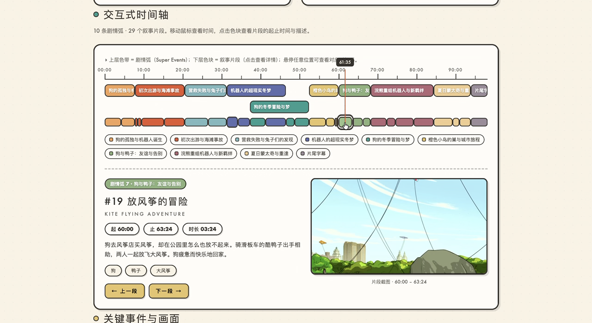

# Cookbook — Qwen-MM-Plugins Video Memory

The long-video capability, `qwen-mm-plugins-video-memory`: hierarchical graph memory for videos
longer than 30 minutes (a single file or a directory of videos). Instead of sampling a handful of
frames, it builds a persistent, searchable memory once, then answers any number of questions
against it — with embedding-based semantic search over entities, events, on-screen text (OCR),
and speech (ASR). See the [Cases](#cases) below for worked examples.

---

## How it works

The memory is a 4-level tree stored next to the video in `<video_path>.memory/`:

```
Root (1 per video — title, themes, key entities, tone)
  └─ SuperEvent (10-20 story arcs)                          super_01, super_02, ...
       └─ MacroEvent (3-8 per SuperEvent, each ~3-8 min)    macro_0001, macro_0002, ...
            └─ Subgraph (entities, events, OCR text, ASR, relations)
```

Typical query = **locate** (one search / navigation call) → **drill down**
(`get_subgraph` on the 1-2 best macro events) → optionally **verify** with `read_video`
on the narrowed time range.

---

## Tools

**Navigation (hierarchy drill-down)**
- `get_summary` — video-level overview: title, description, themes, key entities, emotional tone
- `get_super_events` — list all SuperEvents (narrative arcs) with time ranges and relations (LEADS_TO / RESOLVES / CONTRASTS_WITH)
- `get_macro_events` — list MacroEvents under a SuperEvent (time_range, label, key entities, description)
- `get_subgraph` — full detail for one MacroEvent: entities, events, OCR texts, relations. **The most information-rich tool**

**Search (embedding-based, separate indexes)**
- `search_nodes` — semantic search over Entity / Event nodes (write descriptive statements, not questions)
- `search_ocr_text` — search on-screen text only: scores, stats, jersey numbers, broadcast graphics
- `search_asr_text` — search the speech transcript: dialogue, narration, verbal information
- `search_by_time` — find MacroEvents covering a given `start_sec` / `end_sec` range
- `enumerate_events` — list EVERY matching event in time order — built for counting / "how many times" questions

> For exact schemas, see the capability's `SKILL.md` or each tool's inputSchema.

---

## Install

```bash
claude plugin marketplace add https://github.com/QwenLM/Qwen-MM-Plugins.git
claude plugin install qwen-mm-plugins-video-memory@qwen-mm-plugins

# also install core — memory is coarse, so the skill verifies located segments with
# core's read_video on a narrow time range
claude plugin install qwen-mm-plugins-core@qwen-mm-plugins

# Optional — install the companion video-edit plugin if you want to do long-video
# cut & edit tasks (locate scenes from memory, then trim/order/render into a clip)
claude plugin install qwen-mm-plugins-video-edit@qwen-mm-plugins
```

`ffmpeg` is required to **build** a memory. If it isn't already installed:

```bash
# Debian / Ubuntu
sudo apt-get update && sudo apt-get install -y ffmpeg
# Fedora / RHEL / CentOS
sudo dnf install -y ffmpeg          # or: sudo yum install -y ffmpeg
# Arch Linux
sudo pacman -S ffmpeg
# macOS (Homebrew)
brew install ffmpeg
# Windows (winget / Chocolatey)
winget install Gyan.FFmpeg          # or: choco install ffmpeg
```

## Environment variables

| Variable | Description |
|----------|-------------|
| `DASHSCOPE_API_KEY` | Required — VLM calls during memory build, plus embeddings for build & search. |
| `DASHSCOPE_BASE_URL` | Optional — override the DashScope OpenAI-compatible base URL (proxies/gateways). |
| `GRAPH_MEMORY_PATH` / `EMBEDDINGS_PATH` | Optional — pin the server to a specific `graph_memory.json` / `embeddings.npz`. If unset, memory is auto-located from the `video_path` passed in tool calls (`<video_path>.memory/`). |
| `CUTOFF_SEC` | Optional, query only — load only macro events before this time cutoff. |
| `OSS_AK` / `OSS_SK` / `OSS_ENDPOINT` / `OSS_BUCKET` | Optional, build only — when set, video clips are sent to the VLM as signed OSS URLs; otherwise the build falls back to inline base64 frames (only `DASHSCOPE_API_KEY` needed). **With OSS, frame extraction is much faster — a 1-hour video builds in ~10 min; without OSS the build is CPU-bound and a 1-hour video takes ~40 min.** |

> Set these via env vars, `~/.qwen-mm-plugins/config`, or the guided installer **`bash install.sh`**
> (`bash install.sh verify` checks what's set). Precedence: env var > config file > default.
> System deps: `ffmpeg` is required only to *build* a memory (see [Install](#install)) — query-only
> use needs no system tools.

---

## Using it

Just point `@` at a video in natural language — you never call the build script by hand. `@` can
be a single video file **or** a folder of videos; when it's a **directory**, the videos are
treated as **one continuous source** and merged into a single large memory, so you can ask across
the whole set. Either way the agent runs `build_memory.sh` for you the first time.

For 30+ minutes of footage with no memory yet, the agent **auto-builds** on the first question,
then answers from that memory. If auto-build doesn't kick in, just tell the agent to build first —
e.g. *"build memory for this video first, then answer from the memory"* — and it will build, then
query. It's a one-time cost: once `<video_path>.memory/` exists, every later question queries it
directly and **rebuilds are never triggered again**. Build times: see the OSS note above.

On top of that memory you can do any long-video-understanding task — you don't pre-build first
and then ask; the question itself (e.g. the QA example below) is what triggers the build. Two
common uses:

### 1. Long-video QA

Ask anything about the content — the agent locates the moment in memory and answers:

```
# A single long video
@/data/Friends/S01E01.mp4 What happens in this episode?

# A folder of videos (e.g. a whole season)
@/data/Friends/ Which episode do Ross and Rachel first kiss in?
```

### 2. Long-video cut & edit

The same memory can drive **editing** — locating scenes across a long video (or a whole series)
and cutting them into a finished clip. This needs the companion **video-edit** plugin (see
[Install](#install)). Just describe the edit you want: the agent uses video-memory to find every
relevant moment, then video-edit to trim, order, and render them:

```
@/data/Empresses-in-the-Palace/ Cut a chronological narrative arc of "Consort Hua
scheming against Zhen Huan": from her early covert plotting, through the mounting
pressure, to the poisoning being exposed and the tables turning. Split it with chapter
title cards, timestamp the key beats, add tense BGM and subtitles. Target 30-90s.
```

Give it the **story line and the beats you want** (setup → development → payoff), not a
shot-by-shot script — the agent confirms the exact moments from memory itself.

<details>
<summary>Advanced — build ahead of time or in batch</summary>

To pre-build (or process a directory of videos) from the shell. Paths are relative to the skill
directory — the installed plugin's skill folder, or `src/capabilities/video-memory/skill/` in a
source checkout:

```bash
# Single video → artifacts land in /path/to/video.mp4.memory/
bash script/build_memory/build_memory.sh /path/to/video.mp4

# A directory of videos, custom output dir
bash script/build_memory/build_memory.sh --video-dir /path/to/videos/ --output-dir /path/to/memory
```

Useful flags: `--model NAME`, `--no-asr` (skip transcript), `--asr-model NAME`, `--p2-workers N`
(subgraph-extraction parallelism), `--chunk-sec N`, `--api-key KEY`.
Artifacts: `graph_memory.json`, `embeddings.npz`, `01_macros.json`, `subgraphs/`.

</details>

---

## Cases

### Break down a full feature film into an interactive scene report (Codex)

The prompt that produced the demo:

```
@qwen-mm-plugins-video-memory Use this plugin to analyze the film
/path/to/Robot Dreams (2023).mkv shot by shot and produce a film-breakdown report.
Output it as HTML, in a style that matches the film's mood, including: a synopsis,
the poster, character silhouettes, an interactive timeline, and key events with their
corresponding frame captures. Hovering/clicking on the timeline should reveal each
segment's start/end time and a description.
```

Given the ~100-minute film *Robot Dreams*, the agent builds graph memory for
the whole movie, then walks the hierarchy (`get_summary` → `get_super_events` →
`get_macro_events` → `get_subgraph`, grabbing stills with `read_video`) to generate a
self-contained **interactive film-breakdown report**: 10 story arcs, 29 narrative segments on a
clickable timeline, character profiles, and key moments with frame captures.

▶ **[Open the generated report](https://qianwen-res.oss-accelerate.aliyuncs.com/Qwen-MM-Plugins/asserts/video-memory/video-memory-demo-html.html)** · **[Watch the demo recording](https://qianwen-res.oss-accelerate.aliyuncs.com/Qwen-MM-Plugins/asserts/video-memory/video-memory-demo.mp4)**

<p align="center">
  
</p>

### More query patterns

- **First question auto-builds** — `@/data/movie.mp4 What is this video about?` with no memory
  yet: the agent runs `build_memory.sh`, then answers from `get_summary` + `get_super_events`.
- **Pinpoint a moment** — "Who finished lunch first?": `search_nodes("people finishing lunch together")` →
  `get_subgraph(macro_id)` for timestamps → verify with `read_video` on the narrow window.
- **Scores & counting** — the final score lives in the OCR index
  (`search_ocr_text`, not `search_nodes`); "How many dunks were there?" uses
  `enumerate_events("a player dunks the ball")` to list every occurrence, not a top-k sample.
